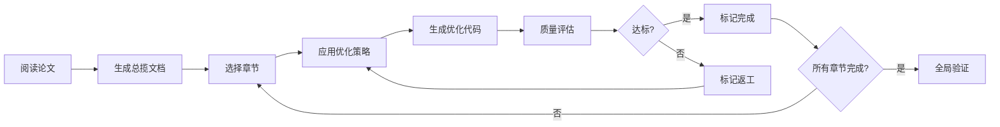

# 🎓 Thesis-Optimizer: 学术论文智能优化系统

<div align="center">

**三维协同优化：降AI检测率 · 降查重率 · 学术润色提升**

[]()
[]()
[]()

[快速开始](#快速开始) • [功能特性](#功能特性) • [安装方法](#安装方法) • [使用指南](#使用指南) • [优化策略](#优化策略详解)

</div>

---

## 📋 目录

- [系统简介](#系统简介)
- [核心功能](#核心功能)
- [优化目标](#优化目标)
- [安装方法](#安装方法)
  - [Antigravity](#1-antigravity-推荐)
  - [Codex](#2-codex)
  - [Cursor](#3-cursor)
  - [Claude Code](#4-claude-code)
  - [其他 Agent](#5-其他兼容-agent)
- [快速开始](#快速开始)
- [使用指南](#使用指南)
- [优化策略详解](#优化策略详解)
- [评估标准](#评估标准)
- [常见问题](#常见问题)
- [技术架构](#技术架构)
- [文件结构](#文件结构)

---

## 🎯 系统简介

**Thesis-Optimizer** 是一个专为**计算机深度学习方向硕士学位论文**设计的智能优化系统。采用**两层文档架构**和**显式状态追踪**机制，实现模块化闭环优化流程。

### 为什么需要此工具？

在学位论文写作过程中，您可能面临以下挑战：

- ❌ **AI 检测率过高**：GPTZero、Originality.ai 等工具检测出 AI 生成痕迹
- ❌ **查重率超标**：知网、维普等平台查重率过高
- ❌ **表达不够学术**：语言风格不符合学术规范，逻辑不够严谨
- ❌ **优化缺乏系统性**：手动修改效率低，难以追踪优化进度

**Thesis-Optimizer 帮助您解决所有这些问题！**

---

## ✨ 核心功能

### 🔍 三维协同优化

| 优化维度 | 核心策略 | 预期效果 |
|---------|---------|---------|
| **降 AI 检测率** | 句式多样化、语气自然化、逻辑人性化 | AI 检测率 < 20% |
| **降查重率** | 深度语义改写、引用规范化、专业术语处理 | 查重率 < 10% |
| **学术润色** | 表达精准化、学术规范性、可读性优化 | 学术质量显著提升 |

### 📊 两层文档架构

```
第一层: 总揽文档 (thesis_master_overview.md)
  ├── 论文整体分析与解读
  ├── 章节划分与优化策略
  ├── 全局进度追踪 [██████░░░░] 60%
  └── 章节状态矩阵
      │
      ├─→ 第二层: chapter_01_abstract.md
      ├─→ 第二层: chapter_02_intro.md
      ├─→ 第二层: chapter_03_method.md
      └─→ ... 其他章节任务文档
```

### 🔄 闭环优化流程

1. **初始化**：完整分析论文，生成总揽文档
2. **逐章优化**：按优先级处理每个章节
3. **质量评估**：参照评估标准验证优化效果
4. **迭代改进**：未达标章节标记返工，持续优化

---

## 🎯 优化目标

| 评估指标 | 目标值 | 评估工具 |
|---------|--------|---------|
| **AI 检测率** | < 20% | GPTZero, Originality.ai |
| **查重率** | < 10% | 知网, 维普 |
| **句式多样性** | 句长标准差 > 8 | 人工检查 |
| **词汇丰富度** | TTR > 0.6 | 词频统计 |

---

## 📦 安装方法

Thesis-Optimizer 是一个通用的 Agent 技能，兼容市面上主流的 AI 编程助手。以下是各平台的安装方法：

### 1. **Antigravity** (推荐)

Antigravity 原生支持 `.agent/skills/` 目录结构。

#### 方法 A：直接克隆（单个项目使用）

```bash
# 进入您的论文项目目录
cd /path/to/your/thesis-project

# 创建 skills 目录（如果不存在）
mkdir -p .agent/skills

# 克隆技能到项目
cd .agent/skills
git clone https://github.com/YOUR-USERNAME/thesis-optimizer.git
```

#### 方法 B：全局安装（所有项目共享）

```bash
# 克隆到 Antigravity 全局 skills 目录
cd ~/.gemini/antigravity/skills  # Antigravity 全局技能目录
git clone https://github.com/YOUR-USERNAME/thesis-optimizer.git
```

#### 验证安装

启动 Antigravity，询问：

```
你有哪些 skills？
```

应该能看到 `thesis-optimizer` 出现在技能列表中。

---

### 2. **Codex**

Codex 使用 `~/.codex/skills/` 作为全局技能目录，项目级技能使用 `.agent/skills/`。

#### 方法 A：使用 Skill Installer（推荐）

```bash
# 打开 Codex
# 输入 $ 并选择 "Skill Installer"
# 粘贴以下 GitHub URL:
https://github.com/YOUR-USERNAME/thesis-optimizer
```

#### 方法 B：手动安装（全局）

```bash
# 克隆到 Codex 全局目录
cd ~/.codex/skills
git clone https://github.com/YOUR-USERNAME/thesis-optimizer.git

# 重启 Codex
```

#### 方法 C：项目级安装

```bash
# 在论文项目目录下
cd /path/to/your/thesis-project
mkdir -p .agent/skills
cd .agent/skills
git clone https://github.com/YOUR-USERNAME/thesis-optimizer.git
```

---

### 3. **Cursor**

Cursor 兼容 Agent Skills 规范，支持从 GitHub 直接导入。

#### 方法 A：通过 Remote Rule 导入

1. 打开 Cursor 设置 (`Cmd/Ctrl + ,`)
2. 搜索 "Remote Rules" 或 "Agent Skills"
3. 点击 "Add Remote Rule (GitHub)"
4. 输入仓库 URL：
   ```
   https://github.com/YOUR-USERNAME/thesis-optimizer
   ```

#### 方法 B：手动克隆

```bash
# 在项目目录下
mkdir -p .agent/skills
cd .agent/skills
git clone https://github.com/YOUR-USERNAME/thesis-optimizer.git
```

---

### 4. **Claude Code**

Claude Code 使用 `.claude/skills/` 目录。

#### 方法 A：通过插件安装

1. 在 Claude Code 中选择 "Browse and install plugins"
2. 如果 thesis-optimizer 已发布到官方插件市场，搜索并安装

#### 方法 B：手动安装

```bash
# 在项目目录下
mkdir -p .claude/skills
cd .claude/skills
git clone https://github.com/YOUR-USERNAME/thesis-optimizer.git
```

---

### 5. **其他兼容 Agent**

#### Windsurf / Aider / Continue.dev

大多数现代 AI 编程助手支持以下标准目录之一：

```bash
# 项目级（优先）
.agent/skills/thesis-optimizer/

# 或全局级
~/.ai-agent/skills/thesis-optimizer/
```

**通用安装步骤**：

```bash
# 1. 确定您的 Agent 技能目录（查阅其文档）
# 2. 克隆技能
cd <your-agent-skills-directory>
git clone https://github.com/YOUR-USERNAME/thesis-optimizer.git

# 3. 重启您的 Agent（如果需要）
```

---

### 📥 下载 ZIP 包（无 Git 环境）

如果您的环境没有 Git，可以直接下载 ZIP：

1. 访问 [GitHub Release 页面](https://github.com/YOUR-USERNAME/thesis-optimizer/releases)
2. 下载最新版本的 `thesis-optimizer.zip`
3. 解压到对应的 skills 目录：
   - Antigravity: `.agent/skills/`
   - Codex: `~/.codex/skills/` 或 `.agent/skills/`
   - Cursor: `.agent/skills/`
   - Claude Code: `.claude/skills/`

---

## 🚀 快速开始

### 第一步：准备论文

确保您的论文是 **LaTeX 格式**（`.tex` 文件）。

### 第二步：启动优化

在您的 AI 助手中（Antigravity / Codex / Cursor 等），输入以下指令：

```
@thesis-optimizer
我的论文路径是 /path/to/thesis/thesis_liuxuewen.tex
请帮我进行降 AI 和降重优化
```

### 第三步：系统自动工作

系统将自动执行以下流程：

1. ✅ **完整阅读论文**：分析结构、内容、论证逻辑
2. ✅ **生成总揽文档**：`thesis_master_overview.md`（保存在论文同目录）
3. ✅ **逐章节优化**：
   - 创建章节任务文档（如 `chapter_01_abstract.md`）
   - 应用三大优化策略（降 AI / 降重 / 润色）
   - 生成优化后的 LaTeX 代码
   - 更新进度状态
4. ✅ **质量评估**：参照评估标准验证效果
5. ✅ **迭代改进**：未达标章节自动返工

### 第四步：查看结果

优化过程中会生成以下文件（在论文同目录下）：

```
论文目录/
├── thesis_liuxuewen.tex             # 原始论文
├── thesis_master_overview.md        # 总揽文档（进度追踪）
├── chapter_01_abstract.md           # 第 1 章优化任务
├── chapter_02_intro.md              # 第 2 章优化任务
├── ...
└── optimized_thesis/                # 优化后的 LaTeX 文件
```

---

## 📚 使用指南

### 基本用法

```
@thesis-optimizer
优化我的论文第 3 章，重点降低 AI 检测率
```

### 高级用法

#### 1. 指定优化目标

```
@thesis-optimizer
对第 2 章进行优化，目标：
- AI 检测率降至 15% 以下
- 查重率降至 8% 以下
- 重点提升学术表达
```

#### 2. 仅优化特定章节

```
@thesis-optimizer
只优化摘要和第 1 章
```

#### 3. 查看优化进度

```
@thesis-optimizer
显示当前优化进度
```

#### 4. 迭代优化

```
@thesis-optimizer
第 3 章的 AI 检测率还是 25%，请再次优化
```

---

## 🛠️ 优化策略详解

### 策略 A：降低 AI 检测率

**核心原理**：打破 AI 写作的规整模式特征，增强人类化特征。

#### 主要技术

1. **句式多样化改写**
   - ❌ 避免：连续并列的规整句式，高度对仗的结构
   - ✅ 采用：长短句交替，句型混合（陈述/疑问/假设）

2. **学术语气自然化**
   - ❌ 避免：过度客观冷静，缺少推理过程
   - ✅ 采用：适度主观判断（"我们认为"），清晰推理链

3. **逻辑链路人性化**
   - ❌ 避免：突兀的逻辑跳转，缺少铺垫
   - ✅ 采用：合理过渡词，循序渐进的论述

**详细策略**：查看 [`references/strategy_ai_reduction.md`](./references/strategy_ai_reduction.md)

---

### 策略 B：降低查重率

**核心原理**：深度语义改写，保持学术质量的同时改变表述方式。

#### 主要技术

1. **深度语义改写**
   - 同义替换：使用学术近义词
   - 句式重组：主动↔被动，因果倒置
   - 表述角度转换：从不同角度描述同一事实

2. **引用规范化**
   - 直接引用 → 间接转述
   - 整合多篇文献观点
   - 添加个人分析和评论

3. **专业术语处理**
   - 核心术语保留（必需的专业名词）
   - 扩展描述（术语 + 解释性描述）
   - 上下文变换（改变术语周围的表述）

**详细策略**：查看 [`references/strategy_plagiarism.md`](./references/strategy_plagiarism.md)

---

### 策略 C：学术润色

**核心原理**：提升学术表达的精准性、规范性和可读性。

#### 主要技术

1. **表达精准化**
   - 量化抽象概念：用数据支撑观点
   - 明确因果关系：清晰的逻辑链
   - 减少模糊表述：用准确术语替代含糊词汇

2. **学术规范性**
   - 术语一致性：全文统一专业术语
   - 时态规范：过去式（他人工作）vs 现在式（本文工作）
   - 引用格式：统一引用风格

3. **可读性优化**
   - 复杂句拆分：一句话只讲一个核心观点
   - 过渡流畅性：段落间、句子间自然衔接
   - 信息层次：重要信息前置

**详细策略**：查看 [`references/strategy_polishing.md`](./references/strategy_polishing.md)

---

## 📊 评估标准

系统会根据以下标准评估优化效果：

### 定量指标

| 指标 | 计算方法 | 目标值 | 评估工具 |
|-----|---------|--------|---------|
| **AI 检测率** | AI生成文本占比 | < 20% | GPTZero, Originality.ai |
| **查重率** | 重复文本占比 | < 10% | 知网, 维普 |
| **句长标准差** | 各句长度的标准差 | > 8 | 人工/脚本统计 |
| **词汇丰富度 (TTR)** | 不同词 / 总词数 | > 0.6 | 词频工具 |

### 定性指标

- ✅ **学术严谨性**：论点明确，论证充分
- ✅ **逻辑连贯性**：章节内外逻辑自洽
- ✅ **表达专业性**：术语准确，符合领域规范
- ✅ **创新性展示**：清晰展现研究贡献

**详细评估标准**：查看 [`references/evaluation_criteria.md`](./references/evaluation_criteria.md)

---

## 🔄 技术架构

### 两层文档架构

#### 第一层：总揽文档 (`thesis_master_overview.md`)

**作用**：
- 📊 宏观视角：论文整体分析、章节划分
- 📈 进度追踪：全局进度条、章节状态矩阵
- 🎯 策略规划：优化策略制定、优先级排序
- 🔗 导航中枢：链接到所有章节任务文档

**状态标记**：
- ⏳ 待处理 (Pending)
- 🟡 进行中 (In Progress)
- 🟢 已完成 (Completed)
- 🔴 需返工 (Re-work Needed)
- ⭐ 已验证 (Verified)

#### 第二层：章节任务文档 (`chapter_XX_name.md`)

**作用**：
- 📝 章节详情：该章节的具体优化计划
- 🔧 优化记录：应用的策略、改写前后对照
- ✅ 质量评估：该章节的评估结果
- 🔙 回链总览：链接回总揽文档

### 闭环优化流程



---

## 📁 文件结构

```
thesis-optimizer/
├── SKILL.md                          # 技能定义文件（Agent 识别）
├── README.md                         # 本文档
├── USAGE_GUIDE.md                    # 详细使用指南
│
├── templates/                        # 文档模板
│   ├── master_overview_template.md   # 总揽文档模板
│   └── chapter_task_template.md      # 章节任务模板
│
└── references/                       # 策略参考文档
    ├── strategy_ai_reduction.md      # 降 AI 检测率策略
    ├── strategy_plagiarism.md        # 降查重率策略
    ├── strategy_polishing.md         # 学术润色策略
    └── evaluation_criteria.md        # 评估标准与方法
```

---

## ❓ 常见问题

### Q1: 支持哪些论文格式？

**A**: 目前仅支持 **LaTeX (.tex)** 格式论文。Word 格式计划在后续版本支持。

---

### Q2: 优化一篇论文需要多长时间？

**A**: 取决于论文长度和复杂度：
- 硕士论文（5-8 万字）：约 2-4 小时
- 单个章节（5000-10000 字）：约 20-40 分钟

---

### Q3: 会修改论文的核心内容吗？

**A**: **不会**。系统仅优化表达方式，不改变：
- ✅ 研究贡献和核心观点
- ✅ 实验数据和结果
- ✅ 公式、图表、表格
- ✅ 引用文献

---

### Q4: AI 检测率能降到多低？

**A**: 目标是 **< 20%**，实际效果取决于：
- 原始论文的 AI 痕迹程度
- 章节内容类型（方法章节更易优化，相关工作较难）
- 领域专业性（专业术语密集度）

---

### Q5: 查重率降低后会影响学术质量吗？

**A**: **不会**。我们采用：
- ✅ 深度语义改写（保持原意）
- ✅ 学术同义词替换（提升表达）
- ✅ 逻辑重组（增强连贯性）

而**非**简单的机械替换或删除。

---

### Q6: 可以只优化部分章节吗？

**A**: **可以**。您可以指定：

```
@thesis-optimizer
只优化第 3 章和第 4 章
```

---

### Q7: 优化后如何验证效果？

**A**: 建议使用以下工具：

| 检测目标 | 推荐工具 |
|---------|---------|
| AI 检测 | GPTZero, Originality.ai, Writer.com |
| 查重检测 | 知网, 维普, PaperPass |
| 语法检查 | Grammarly, LanguageTool |

系统会在章节任务文档中记录评估结果。

---

### Q8: 多人论文怎么协作优化？

**A**: 建议工作流：
1. 将论文和 `.agent/` 目录纳入 Git 版本控制
2. 每人负责不同章节
3. 通过 Pull Request 合并优化结果
4. 总揽文档自动追踪所有章节状态

---

### Q9: 遇到错误怎么办？

**A**: 请检查：
1. ✅ 论文路径是否正确（绝对路径）
2. ✅ `.tex` 文件是否完整（可编译）
3. ✅ Agent 是否正确加载技能（询问 "你有哪些 skills?"）
4. ✅ 查看 Agent 日志中的错误信息

仍有问题？请提交 [GitHub Issue](https://github.com/YOUR-USERNAME/thesis-optimizer/issues)。

---

### Q10: 可以用于英文论文吗？

**A**: 当前版本主要针对**中文论文**优化。英文论文支持计划在 v2.0 版本推出。

---

## 📖 更多资源

- 📘 [详细使用指南](./USAGE_GUIDE.md)
- 🔧 [自定义优化策略](./references/strategy_ai_reduction.md)
- 📊 [评估标准详解](./references/evaluation_criteria.md)
- 💬 [GitHub Discussions](https://github.com/YOUR-USERNAME/thesis-optimizer/discussions)
- 🐛 [报告问题](https://github.com/YOUR-USERNAME/thesis-optimizer/issues)

---

## 📜 许可证

本项目采用 [MIT License](./LICENSE)。

---

## 🙏 致谢

感谢所有为学术写作优化研究做出贡献的学者和开发者。

---

## 📞 联系方式


- Email: liuxuewen516@163.com

---

<div align="center">

**🎓 让学术写作更轻松，让论文质量更优秀！**

[⬆ 返回顶部](#-thesis-optimizer-学术论文智能优化系统)

</div>
